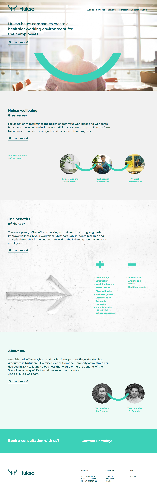

# Hukso's Website

This is a website I built in 2018 for a Scandinavian startup.

## Technologies used:

* HTML
* CSS

## My contribution and what I have learned

* I discussed the initial idea with the client and we kept sharing feedback throughout the whole process.
* I provided him with Laptop, mobile and tablet website mockups designed with Photoshop.
* I wrote the code to generate a responsive, light website using:
  * Sass
  * Media queries
  * Pretty URLs
  * Google Maps API

## Website Screenshots
<space><space>

### Laptop version

### Tablet version 

### Mobile version

